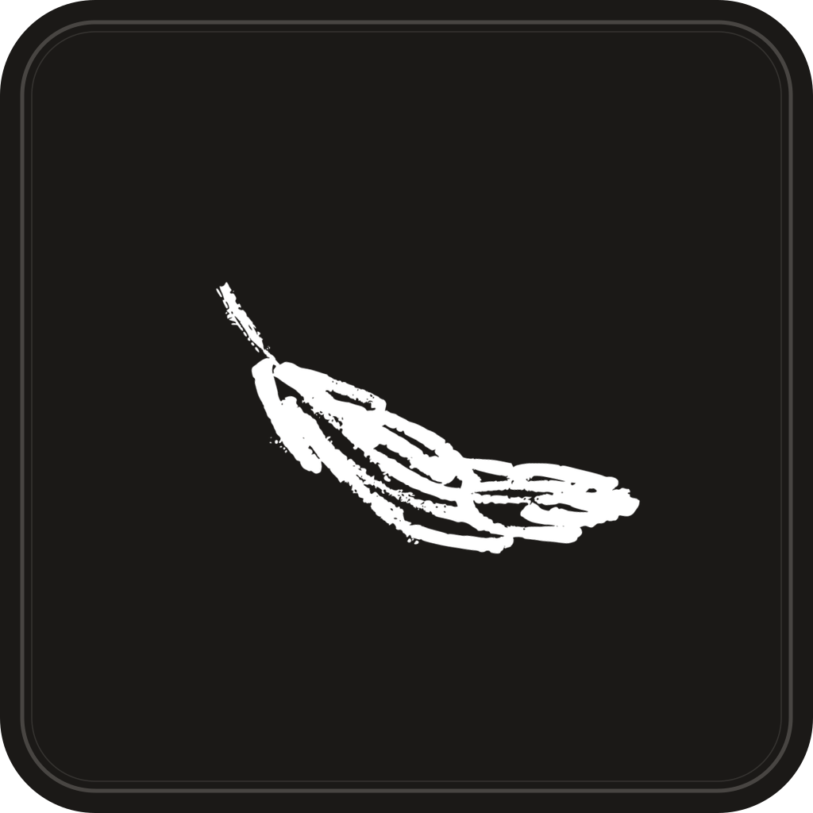

<div align="center">
  
  <h1>FeatherCode</h1>
  <p><strong>Dev workspace built on Terax with modular skills and local model integration.</strong></p>
</div>

---

## ⚠️ Work in Progress

This project is under active development. Expect bugs, broken features, and unpolished layouts. Report issues [here](https://github.com/David-bit986/feathercode/issues).

---

## About

FeatherCode forks [Terax](https://github.com/crynta/terax-ai). I built this fork to add features missing from Terax and Antigravity.

### Key Additions

- **Modular Skills**: Import folders as skill sets, toggle them, and trigger them using `/skill-name` in chat.
- **Provider Support**: Integrates DeepSeek, Mistral, xAI, OpenRouter, LM Studio, MLX, and Ollama.
- **Isolated Sessions**: Each workspace maintains its own chat history.
- **Visual Themes**: 10 themes (Feather, Claude, Tokyo Night, Nord, Tide, Sage, Catppuccin, Gruvbox, Rosé Pine, Caffeine) with light and dark modes.
- **Clean Interface**: Omit all Terax branding from UI, config, and shell integration.
- **Fixes**: Resizable AI panels, terminal right-click text copying, concurrent chat during agent execution, and direct navigation from notifications to active sessions.

[Terax](https://github.com/crynta/terax-ai) provides the underlying backend (PTY, WebGL terminal, agentic pipeline, CodeMirror integration, and Git tooling).

## Install

Download the installer from [Releases](https://github.com/David-bit986/feathercode/releases/latest).

### Windows Run Steps
- Windows Defender shows "Windows protected your PC" on first launch. Click **More info**, then **Run anyway**.
- Shell priority order: `pwsh.exe`, `powershell.exe`, `cmd.exe`.

## Build from Source

```bash
pnpm install
pnpm tauri dev          # Run development app
pnpm tauri build        # Build production executable
```

**Prerequisites:** Rust stable ([rustup.rs](https://rustup.rs)), Node 20+, [pnpm](https://pnpm.io), and [Tauri prerequisites](https://tauri.app/start/prerequisites/).

## Stack

Tauri 2, Rust, portable-pty, React 19, TypeScript, Vite, xterm.js, CodeMirror 6, Vercel AI SDK v6, Tailwind v4, shadcn/ui, Zustand, Lucide.
